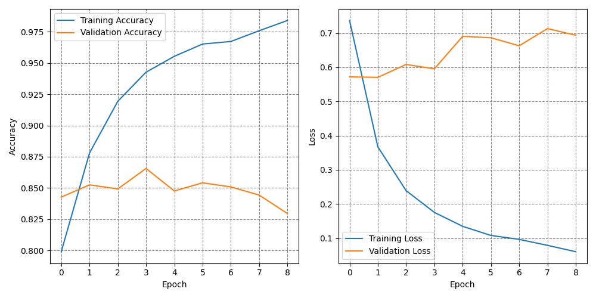

# MoodSense - Emotion Detector

This is a facial emotion recognition application developed in May 2024 as a Computational Intelligence project.

The project classifies person's facial emotions into one of seven categories - **happy, sad, neutral/contemptuous, angry, disgusted, fearful** and **surprised**. The main model is trained on The Extended Cohn-Kanade (CK+) dataset, which contains 920 images of size 48x48. Second model I trained on FER-2013 dataset, mostly for observations. 

Application detects person's emotions and reacts to them. For example, it plays music or shows a cute picture when the user is angry, sad or disgusted. It offers popcorn to a surprised person and wishes a nice day when it sees happiness.

### Dependencies

`Python` `Tensorflow` `Keras` `OpenCV` `Scikit-learn`

To install the required packages, run `pip install -r requirements.txt`

### Basic usage

(Optional) If you prefer to use FER-2013 dataset, download it from [here](https://www.kaggle.com/datasets/msambare/fer2013) and extract in the root directory of this repository. In my version, I manually deleted test/ directory and moved class directories from train/ to the main dataset directory. CK+ dataset is already in the repository.

- The folder structure:

`./`

| - `actions/` - free music from [pixabay.com](https://pixabay.com/) and pictures of animals

| - `emotions-dataset/` - CK+ dataset

| - `plots/` - learning curves and confusion matrix heatmaps for the trained models

| - detector.py - application with face detection

| - haarcascade_frontalface_default.xml - Haar Cascade Classifier configuration

| - main.py - main program

| - model_plots.py - functions for plotting learning curves and confusion matrix

| - preprocessing.py - preparing data for model training

| - training.py - training the CNN model

| - opracowanie_projektu_1.pdf - detailed project description in Polish

- After installing required packages and cloning the repository, you can run the main program:

```sh
python main.py
```

Output:

```
||   (✿◠‿◠) Welcome to MOODSENSE!
|| Your small Emotion Detector ;3
||
||   You can run the program with following options:
||   ✿ -t, --train  - performs data preprocessing, trains the detection model and shows important statistics
||   ✿ -r, --run    - runs the main detection program
||
||   Let's go!
```

- To train the model, run:

```sh
python main.py -t
# or
python main.py --train
```

After training, plots and model will be saved in appropriate files.

- To use the application, run:

```sh
python main.py -r
# or
python main.py --run
```

### Results

1. In my simple CNN for CK+ dataset, the test accuracy reached 100% in 12 epochs.


2. For FER-2013 dataset, the test accuracy reached 85.56% after 20 epochs of training on original dataset and 10 epochs on dataset after downsampling.

